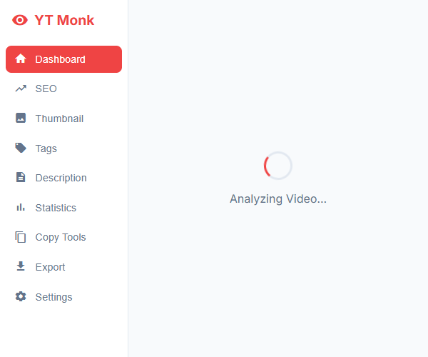
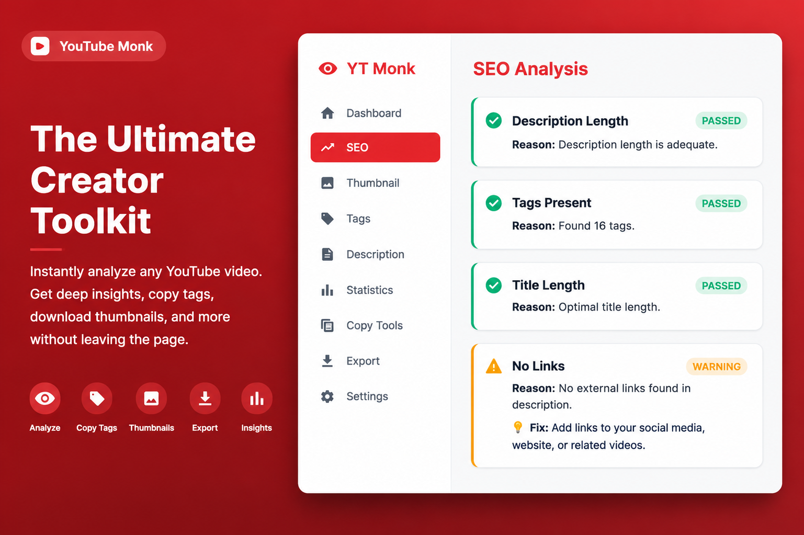
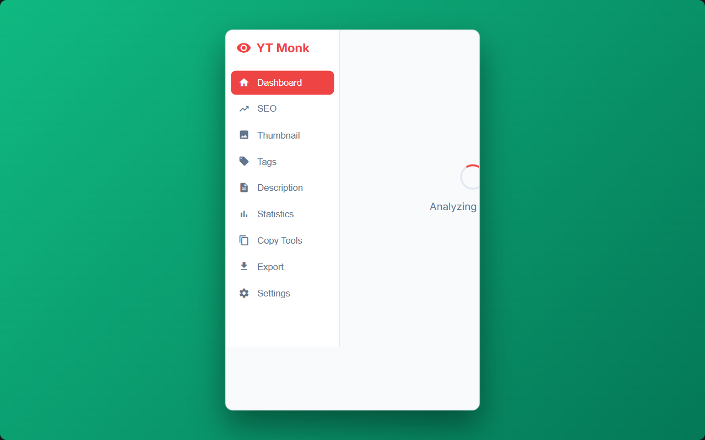
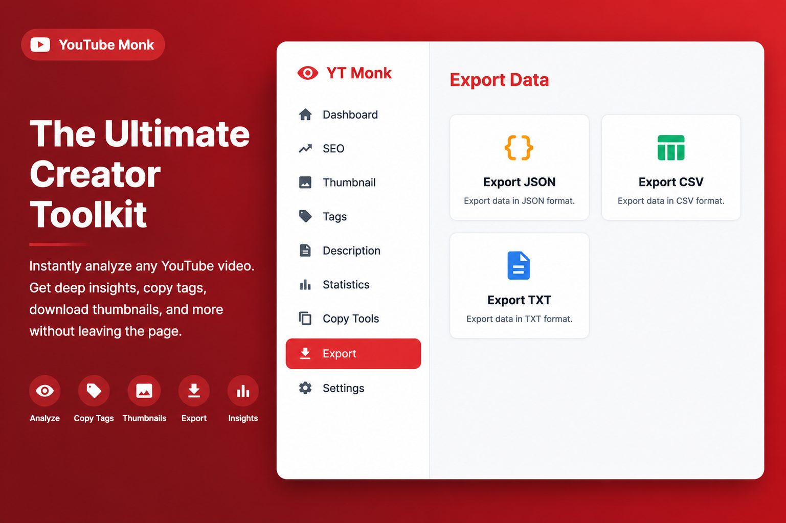

# YouTube Monk - YouTube SEO Tool

**The Ultimate YouTube SEO & Creator Toolkit**

YouTube Monk is a lightweight, modern, and powerful Chrome Extension built for YouTube creators, SEO experts, and digital marketers. Get instant insights into any YouTube video with zero setup and no required backend.

---

## 📸 Screenshots

*(Place your generated promotional screenshots in the `store/` folder)*

| Dashboard | SEO Analysis |
| :---: | :---: |
|  |  |

| Statistics | Export Data |
| :---: | :---: |
|  |  |

---

## Features

- **Instant Dashboard**: View total likes, views, upload dates, and channel details.
- **SEO Analysis**: Generate a real-time SEO score (0-100) based on title, description, tags, and more.
- **Thumbnail Downloader**: Preview and download thumbnails in MaxRes (HD) to Default resolutions.
- **Tags Extractor**: Extract all hidden tags with one click and export them easily.
- **Copy Tools**: Instantly copy video details, titles, descriptions, and tags.
- **Export Data**: Download video metadata as JSON, CSV, or Text format for off-line research.

## Installation (Unpacked)

1. Clone or download this repository.
2. Open Google Chrome and go to `chrome://extensions/`.
3. Enable "Developer mode" in the top right corner.
4. Click "Load unpacked" and select the folder containing this extension.
5. Open any YouTube video and click the YouTube Monk icon.

## Architecture

Built purely with vanilla JavaScript, HTML, CSS, and Chrome Manifest V3 APIs. No external dependencies, ensuring maximum speed, security, and privacy.

---

## 👨‍💻 Developer

**HABEEB RAHMAN**

- 🚀 [Best Freelance SEO](https://www.bestfreelanceseo.com/?utm_source=google&utm_medium=referral&utm_campaign=chrome)
- 🐙 [GitHub](https://github.com/habeebrahmanb)
- 💼 [LinkedIn](https://www.linkedin.com/in/habeebrahmanb)

## License

MIT
